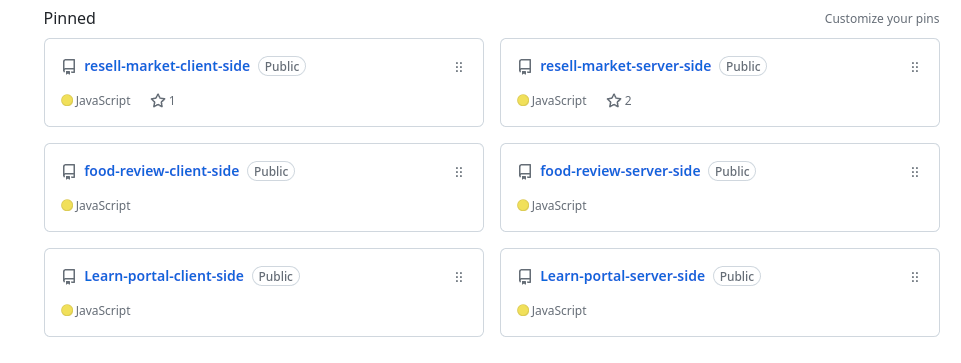

<!-- name -->
<h1 align="center">Hi 👋, I'm Hasan Chowdhuri</h1>
<!-- banner -->

## :mailbox: Reach me out

 

    <!-- linkedIN -->
    
    <!-- facebook -->
    
    <!-- twitter -->
    

 

<!-- skills -->
## :computer: Technologies that I know
 

 

## :chart_with_upwards_trend: Current Stats

 

  
   
  

<!-- about -->
<h1>About Me</h1>

MERN Stack Developer || Front-end web developer React.js based
I am Experienced with React.js, JavaScript, Express.js and MongoDB
 
 
I am a programmer and I am happy with this job. Because I like technology . The use of technology is increasing in the world. I want to make technology easy to reach people.
 
 
I am expert with JavaScript, React.js, CSS, Bootstrap, React Bootstrap, Tailwind, DaisyUI, HTML, Express.js, Firebase, MongoDB and I used many tools (Github, Netlify, Canva, Figma, React Icons, React Router, React Toast, React Query, React Photo View, React Hook Form,JWT, Context API etc).
 
 
I have worked on many of my projects. Every project is different and works Front-End, Backend and design done by me. I love productive work and try to concentrate as long as I work.
 
 
I am freedom loving person. I enjoy work. The only difference between me and those who upgrade the world is skill. I will work to improve myself. I dream of giving something new to the world one day.
 
 
📧 hasanchowdhuri97@gmail.com  
⌨️ 𝘛𝘦𝘹𝘵 | 𝘞𝘩𝘢𝘵𝘴𝘈𝘱𝘱: +4901788026998  
📞 𝑪𝒂𝒍𝒍 | Phone: 0033745709860  
<a href="https://www.hasanchowdhuri.com">Developer Portfolio</a> 
 
<a href="https://drive.google.com/file/d/1EQlyZiuYF5ejqBoFCw0jc-CDtyRQyzs_/view?usp=share_link">Download developer resume</a>

 

