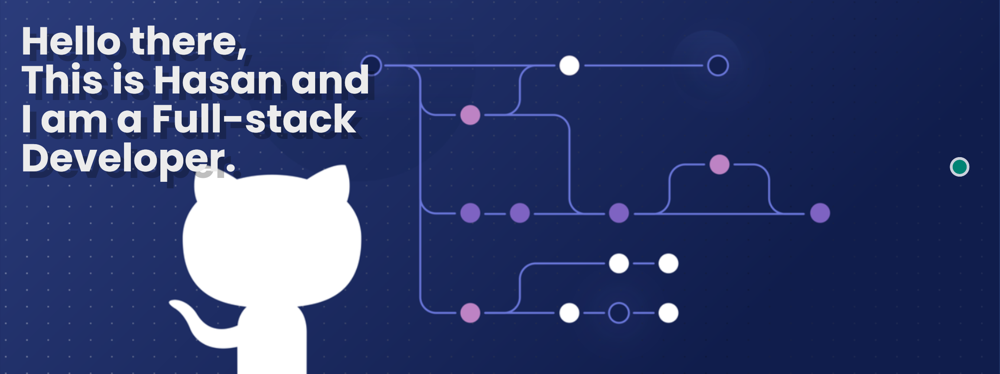

<!-- name -->
<h1 align="center">Hi 👋, I'm Hasan Chowdhuri</h1>
<!-- banner -->

## :mailbox: Reach me out

 

    <!-- linkedIN -->
    
    <!-- facebook -->
    
    <!-- twitter -->
    

 

<!-- skills -->
## :computer: Technologies that I know
 

 

## :chart_with_upwards_trend: Current Stats

 

  
   
  

<!-- about -->
<h1>About Me</h1>

    <strong>MERN Stack Developer | Front-End React.js Specialist</strong>
      
    I am an experienced web developer specializing in the **MERN stack** with expertise in **React.js, JavaScript, Express.js, and MongoDB**. Passionate about technology, I strive to make it more accessible and user-friendly.
      
    My core skills include **JavaScript, React.js, CSS, Bootstrap, React Bootstrap, Tailwind CSS, DaisyUI, HTML, Express.js, Firebase, and MongoDB**. Additionally, I work with various tools such as **GitHub, Netlify, Canva, Figma, React Icons, React Router, React Toast, React Query, React Photo View, React Hook Form, JWT, and Context API**.
      
    Over time, I have developed numerous projects where I handled **front-end, back-end, and UI/UX design**. I am passionate about writing clean, efficient, and scalable code, ensuring high-quality solutions tailored to user needs.
      
    My goal is to continuously **enhance my skills** and contribute to technological advancements. I aspire to create **impactful and innovative solutions** that improve people's lives.
      
    📧 **Email:** <a href="mailto:hasanchowdhuri97@gmail.com">hasanchowdhuri97@gmail.com</a>  
    📱 **WhatsApp:** <a href="https://wa.me/33745709860">+33 7 45 70 98 60</a>  
    📞 **Phone:** <a href="tel:+33745709860">+33 7 45 70 98 60</a>  
    🌐 <a href="https://www.hasanchowdhuri.com" target="_blank">Developer Portfolio</a>  
    📄 <a href="https://drive.google.com/file/d/1EQlyZiuYF5ejqBoFCw0jc-CDtyRQyzs_/view?usp=share_link" target="_blank">Download My Resume</a>

